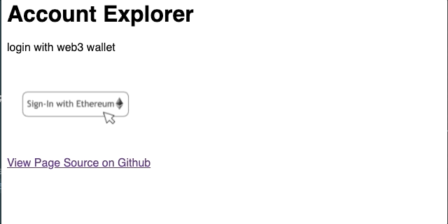

# Sign In With Ethereum

login with web3 wallet

Demo at https://sign-in-with-ethereum.netlify.app/.

## TODO

1. ✅  Launch MetaMask extension on button click
1. ✅  Display public Account information
1. ✅  Show warning if web2 browser
1. ⬜️ Show ens name if any
1. ⬜️ Verify user by asking them to sign a message with their private key
1. ⬜️ Sign in with SOLANA
1. ⬜️ Mint eth nft
1. ⬜️ Mint sol nft (to compare prices of txns)

## Running

* serve locally `python3 -m http.server 8000 --bind 127.0.0.1`
* open `http://localhost:8000`

## Dependencies

* https://docs.ethers.io/v5/

## Credits

Inspired by:
1. https://twitter.com/BrantlyMillegan/status/1402388133086367751
1. https://twitter.com/gregisenberg/status/1435234043583467526